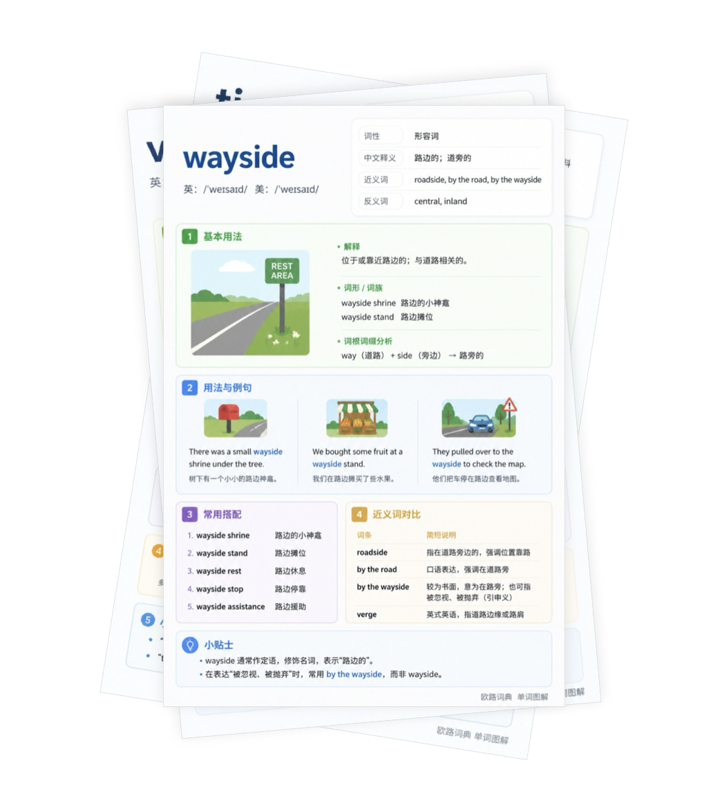

# COCA 6000 Vocabulary Cards

基于 COCA（Corpus of Contemporary American English）高频词表制作的英语单词卡片与欧路词典扩充词库。

  

## 项目简介

本项目旨在整理一套适合长期英语学习的高质量词汇资源，包括：

- COCA 6000 高频词汇
- 单词卡片（持续更新）
- 欧路词典扩充词库
- 免费公开分享

目前第一批 1000+ 单词卡已经完成生成与审核，其余词汇正在持续整理中。

---

## 项目特点

### 📚 基于 COCA 高频词表

优先学习真实英语语料中的高频词汇，提高学习效率。

### 🗂 单词卡系统化整理

适合：

- 日常背单词
- 考研英语
- 四六级
- 雅思 / 托福
- 英语长期积累

### 📖 欧路词典支持

已同步制作欧路词典扩充词库，可直接导入使用。

### 🎁 免费开放

所有资源均免费提供。

---

## 当前进度

- [x] 第一批 1000+ 单词卡完成
- [x] 第一轮人工审核完成
- [x] 欧路词典扩充词库制作完成
- [ ] COCA 6000 全量审核中
- [ ] 后续版本优化中

---

## 使用说明

### 欧路词典导入

1. 下载词库文件
2. 打开欧路词典
3. 导入扩充词库
4. 开始使用

---

## 免责声明

本项目图片由AI生成，已经过人工初步校对，但不能保证内容绝对权威。

---

## Star Support ⭐

如果这个项目对你有帮助，欢迎 Star 支持一下～  
后续会持续更新与优化。